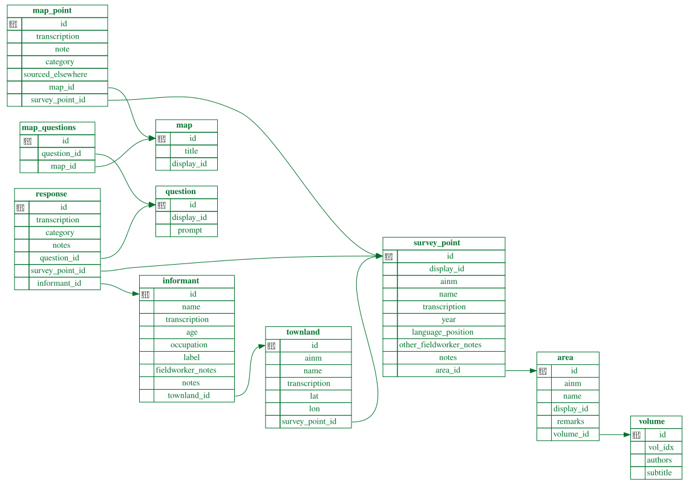

# Digitisation of the Linguistic Atlas and Survey of Irish Dialects

## Background

This project continues work by Eoghan Mac Éinrí, Ciarán Ó Duibhín and Brian Mac
Lochlainn, described
[here](https://www.teanga.info/oduibhin/oideasra/lasid/doc/lasid.htm) by
Ciarán.

As Ciarán puts it:

> The Linguistic Atlas and Survey of Irish Dialects (LASID) is a 4-volume work
> by [Heinrich Wagner](https://www.dib.ie/biography/wagner-heinrich-hans-a8837), first published by the Dublin Institute for Advanced Studies between 1958 and 1969, containing the responses, in phonetic notation, to 1175 questions as to the local Gaelic language equivalents of selected English words and phrases, at some 90 locations in Ireland, 7 in Scotland, and 2 in the Isle of Man.
>
> Volume 1 consists of 300 maps, each of which displays, for the Irish and Manx locations, the responses to one, two or three questions (230, 69 and 1 map respectively). Each map is headed by the English words or phrases used in the question(s) mapped, and by the most common Gaelic wordings (in normal spelling) which occur in the responses to those questions. We here treat a multi-question map as a number of separate maps, and thus we have 371 maps in total.

The previous work involved digitisation of the transcriptions in the Volume 1
maps by Eoghan Mac Éinrí, for use with a computer retrieval system developed by
Ciarán Ó Duibhín and Brian Mac Lochlainn. Eoghan Mac Éinrí's
[PhD thesis](https://pure.qub.ac.uk/en/studentTheses/computer-aided-contributions-to-the-study-of-irish-dialects/)
describes this in greater detail[^digitisation]. Further work by Ciarán is
described in the first link[^ciarán].

This project aims to continue this work by digitising more parts of the LASID,
making the data more accessible to modern computing environments, and taking
advantage of advances in technology that allow for easier data visualisation
and interaction.

Specific practical goals are as follows:

* ✅ to build a queryable database containing the previously digitised transcriptions from
the Volume 1 maps
* ⏳ to digitise the Scottish transcriptions for the Volume 1 maps, not included
in the previous digitisation
* ✅ to add longitude and latitude of each location surveyed, for generation of
maps
* ✅ to add biographical information about the speakers surveyed
* ⏳ to add word categories to the transcriptions, for generation of
lexical isoglosses
* ✅ to allow addition of transcriptions from survey responses to questions not
shown in the Volume 1 maps
* ⬜ to build a webpage where the database information is displayed on
interactive maps

## Technical details

### Summary

The LASID data is stored in a SQLite relational database. As the data is
static and suitably small, this is version controlled in a plain-text
[`.sql`](create.sql)
file (containing the schema, geographical information, and informant details),
and [`.csv`](data/) files containing the transcription information.

A script is provided for building the SQLite database.

The database can then be queried, for example, to retrieve all transcriptions
and survey point IDs where locations where the word _tórramh_ is used for
funeral:

```sql
sqlite> select survey_point.display_id, map_point.transcription
   ...> from survey_point
   ...> join map_point on survey_point.id = map_point.survey_point_id
   ...> join map on map_point.map_id = map.id
   ...> where map.title = "funeral"
   ...> and map_point.category = "tórramh";
64|t+õː+r+ʰ+ə
65|t+ɔː+r+ʰ+u
66|t+ɔː+r+u
68|t+ǫː+r+ʰ+ŭ
69|t+ɔː+r+ʰ+u
70|t+ɔː+r+ʰ+i
71|t+ɔː+r+ʰ+u
72|t+ɔː+r+u
72|t+ɔː+r+ʰ+u
73|t+ǫː+r+u
74|t+ɔː+r+h+u+φ
75|t+ɔ̨ː+r·+u
76|t+ɔː+r+u
77|t+ɔː+r+u
78|t+ɔː+r+u
79|t+ɔː+r+ʰ+u+φ
80|t+ɔː+r+ʰ+ŭ
81|t+ɔː+r·+u+φ
82|t+ɔː+r+u
83|t+ɔː+r+u
83|t+ǫː+r+h+uː
84|t+oː+r+ʰ+ɛ+ŭ
85|t+ɔː+r+ŭ
86|t+ɔː+r+u+h+ˀ
```

The `+` character is used as a delimiter between phonetic symbols denoting one
sound, which are
often composed of more than one unicode character, e.g. `ɔː` or `ɴ′`.

To retrieve information about the informants for a particular survey point:

```sql
sqlite> select informant.name, informant.transcription, age, occupation
   ...> from informant
   ...> join townland on informant.townland_id = townland.id
   ...> join survey_point on townland.survey_point_id = survey_point.id
   ...> where survey_point.display_id = "a";
John Henderson|i.ən mə kẹ.nrïk′|75|retired farmer
Donald Craig|ˈdǫːɫ ək ɑ̆ ˈxɑ’rɪg′|61|farmer
John Robertson|ˈi.ən′ mək ˈrǫːḅ|90|carpenter
```

The phonetic transcriptions of placenames and personal names have not been
delimited with `+`, though this could be done as future work if there is desire
to be able to process these in a similar way to the survey response
transcriptions.

To retrieve all the unique words collected in response to a survey
question[^frogs]:

```sql
sqlite> select distinct category from response
   ...> join question on response.question_id = question.id
   ...> where question.prompt = "frog";
laprachán
cnádán
frog
frosg
lapadán
tortán
breallach lathaí
frús
lúbar lathaí
lapadóir
crúbán claidhe
luascan lathaí
losgann
crónán
leumachan
mial-mhàgain
```

### Installation and setup

You will need:

* [uv](https://docs.astral.sh/uv/getting-started/installation/), which will install a Python toolchain if
  you don't already have one, and will manage dependencies
* SQLite, which comes installed on many Linux and macOS distributions, and can
  be downloaded [here](https://www.sqlite.org/download.html) for those
  operating systems as well as Windows.

With this basic toolchain in place, you can build the database with `uv run poe
build_db`. The database will be saved as `lasid.db`. You can start an
interactive SQLite session with `sqlite3 lasid.db`.

### Database schema



The `map_questions` table relates Volume 1 maps to specific questions/prompts
in the survey. The `map_point` table describes a phonetic point on the Volume 1
maps.

## Example analysis script uses

### Comparing realisations of ⟨ó⟩

The script [`analysis/long_o_maps.py`](analysis/long_o_maps.py) produces maps
displaying information about the realisation of ⟨ó⟩, for example:

<center>

</center>

Note that vowel length and nasalisation are ignored in this map.

### Word maps

Lexical maps can also be generated using
[`analysis/word_map.py`](analysis/word_map.py), e.g.:

```shell
uv run analysis/word_map.py --map_title cattle --cmap Paired
```

<center>


</centre>

The scatter plot doesn't show when there is more than one word at a location,
as there is in Kintyre here. The text plot does show this, but is harder to
read, particularly when a lot of different words are close together.
Ultimately these will be better viewed on an interactive map, or will need
slightly more intelligent plotting on static maps.

### Same word, different meaning geographically

```shell
uv run analysis/same_word_diff_usage.py -cat tórramh -cat tórradh
```

<center>

<center>

[^digitisation]: The digitisation of the transcriptions is very arduous (though
perhaps less so now than in the 1970s). I am very grateful to be able
to build on this previous work. I have experimented with OCR but it is
challenging with so many diacritics. It would need very careful checking of the
results. We do, however, have lots of labelled training data thanks to the
previous work, so it may make sense to revisit OCR.

[^ciarán]: Thank you to Ciarán for providing the transcription data, background
information and encouragement.

[^frogs]: Further frog words can be found at
[mcla.ug/froganna.html](https://mcla.ug/froganna.html).
